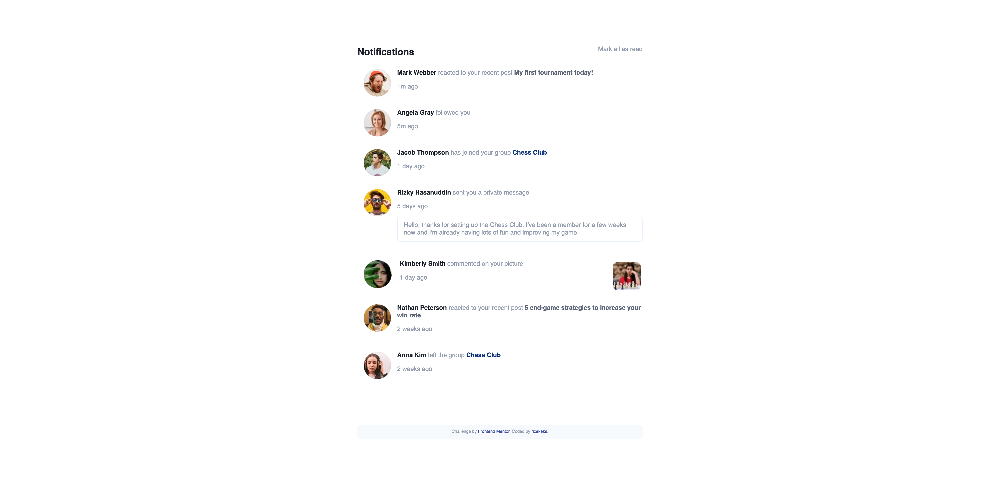

# Frontend Mentor - Notifications page solution

This is a solution to the [Notifications page challenge on Frontend Mentor](https://www.frontendmentor.io/challenges/notifications-page-DqK5QAmKbC). Frontend Mentor challenges help you improve your coding skills by building realistic projects. 

## Table of contents

- [Overview](#overview)
  - [The challenge](#the-challenge)
  - [Screenshot](#screenshot)
  - [Links](#links)
  - [Built with](#built-with)
  - [Known issues](#known-issues)
- [Author](#author)

## Overview

### The challenge

Users should be able to:

- Distinguish between "unread" and "read" notifications
- Select "Mark all as read" to toggle the visual state of the unread notifications and set the number of unread messages to zero
- View the optimal layout for the interface depending on their device's screen size
- See hover and focus states for all interactive elements on the page

### Screenshot

### Links

- Solution URL: [Add solution URL here](https://github.com/ricekeks/notifications-page)
- Live Site URL: [Add live site URL here](https://ricekeks.github.io/notifications-page/)

### Built with

- Semantic HTML5 markup
- CSS custom properties
- Flexbox
- Mobile-first workflow

### Known issues
For some reason I can not get behind at the moment the "Mark all as read" only turns off a few elements. To turn off all elements a total amount of 3 clicks have to be made. Any help or explanation for that behaviour is greatly appreciated.

## Author

- Frontend Mentor - [@ricekeks](https://www.frontendmentor.io/profile/ricekeks)
